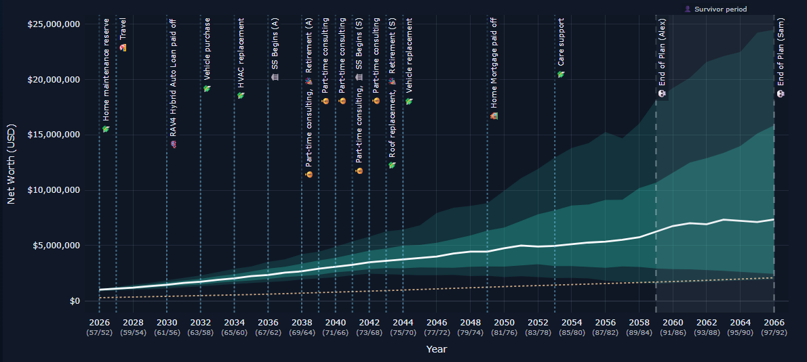

# Net Worth Navigator


[](https://github.com/LemurTech/Net-Worth-Navigator/issues)


[](https://www.gnu.org/licenses/gpl-3.0)



**v1.3.0** — A local net worth projection and financial event modeling tool. Create and compare multiple scenarios.

> **Got 30 seconds?** Jump straight to [Quick Start: View a Sample](#try-the-sample-scenario-recommended)
> and see a working projection without touching the command line.

---

## How It Started

I was late to the retirement savings game.

The first part of my adult life was spent careening through a series of interesting, questionable, and financially unsound adventures far from my home country. I was 43 before I made my first 401(k) contribution.

I also grew up in a household where financial education simply was not a thing. No investing basics. No retirement planning. No explanation of what a 401(k) was supposed to do, or why compound interest was quietly judging me from the future.

So it took me a while to get my bearings.

As I got closer to my 60s, the vague anxiety started turning into specific questions. What kind of retirement could my wife and I reasonably plan for? Could we stay in the U.S. in the house we loved? Would we need to move overseas for a lower-cost life? What would happen if we retired earlier, later, spent more, spent less, downsized, or changed course?

The frustrating part was not that the questions were complicated. The frustrating part was that I could not easily model them.

I wanted a retirement planner I could actually tune: change an assumption, add a planned expense, shift a retirement date, adjust income, compare scenarios, and see the impact quickly. I did not want to fight a spreadsheet. I did not want to re-enter the same numbers into a dozen calculators. And I did not want another monthly subscription for something I might only use a few times a year.

So I started building **Net Worth Navigator**.

It began as a way to answer my own questions with more clarity and less guesswork. The goal is not to predict the future perfectly. The goal is to make the tradeoffs visible, test assumptions quickly, and turn retirement planning from a fog bank into something you can actually navigate.

I do **not** have a background in accounting or financial planning. I'm way more comfortable in PowerShell than in Python and JavaScript — which is what this project is made of. This project is **vibe coded**. AI lets me focus on the creative work and the architecture side without getting bogged down in every implementation detail. If that bothers you, that's fine — this project may not be for you. Somewhere in here there's probably code that would make a senior developer wince.

But despite being built this way, a ton of time, care, and **actual token cost** has gone into making something that actually works. If you find it useful, please consider [buying me a coffee](#support-the-project).

---

## Table of Contents

- [Quick Start](#quick-start)
  - [Prerequisites: Install Python](#prerequisites-install-python)
  - [Get the Code](#get-the-code)
  - [Try the Sample Scenario (Recommended)](#try-the-sample-scenario-recommended)
  - [Create Your Own Scenario](#create-your-own-scenario)
- [What It Does](#what-it-does)
- [Feature Overview](#feature-overview)
- [Sample Scenarios](#sample-scenarios)
- [Using the Web UI](#using-the-web-ui)
  - [The Projection Shell](#the-projection-shell)
  - [The Scenario Setup Panel](#the-scenario-setup-panel)
  - [The Compare Page](#the-compare-page)
  - [Help Mode](#help-mode)
- [Data Sources](#data-sources)
  - [Manual Entry (No Accounts Needed)](#manual-entry-no-accounts-needed)
  - [Monarch Money (Live Sync)](#monarch-money-live-sync)
  - [CSV Import](#csv-import)
- [Who This Is For](#who-this-is-for)
- [Who This Is Not For (Yet)](#who-this-is-not-for-yet)
- [Current Modeling Status](#current-modeling-status)
- [Project Structure](#project-structure)
- [Configuration](#configuration)
- [Security Notes](#security-notes)
- [Support the Project](#support-the-project)
- [License](#license)

---

## Quick Start

### Prerequisites: Install Python

Net Worth Navigator is a Python application. You need **Python 3.11 or later** to run it.

**New to Python?** Here's what to do:

1. **Download Python** from [python.org/downloads](https://www.python.org/downloads/). Get the latest 3.11.x, 3.12.x, or 3.13.x release.
2. **Install it.** On Windows, **check the box that says "Add Python to PATH"** during installation — this is critical. On Linux/macOS, your system may already have Python (run `python3 --version` in a terminal to check).
3. **Verify.** Open a terminal (PowerShell on Windows, Terminal on macOS/Linux) and run:
   ```
   python --version
   ```
   (On Linux/macOS you might need `python3 --version` instead.)
   
   You should see something like `Python 3.12.4`. If you see `Python 3.11` or higher, you're good.

**What's a "virtual environment"?** You'll see `.venv` in many commands below. A virtual environment is an isolated folder that keeps this project's dependencies separate from your other Python projects. You create it once and activate it when you want to run the app. The commands below handle creating and using it — follow along and you'll be fine.

**On Linux:** You may also need to install the `python3-venv` package:
```bash
# Debian/Ubuntu
sudo apt install python3-venv python3-pip

# Fedora
sudo dnf install python3-virtualenv

# Arch
sudo pacman -S python-virtualenv
```

### Get the Code

```bash
cd <directory where you want to install NWN>
git clone https://github.com/LemurTech/Net-Worth-Navigator.git
cd Net-Worth-Navigator
```

**Windows:** If you don't have Git installed, download it from [git-scm.com](https://git-scm.com/). There are plenty of YouTube videos and blogs that will walk you through a proper installation. If that puts you off, you can also just download the repository as a ZIP from the project page and extract it to a folder of your choice. (But the magic of Git is that it makes the app super-easy to update later on!)

### Set Up the Environment

```bash
# Create a virtual environment (do this once)

# Linux/macOS:
python3 -m venv .venv

# Windows PowerShell:
python -m venv .venv

# Install dependencies (do this once)
# Linux/macOS:
.venv/bin/python -m pip install -r requirements.txt

# Windows PowerShell:
.venv\Scripts\python.exe -m pip install -r requirements.txt
```

**Troubleshooting:** If `pip install` fails, make sure you're using the `.venv/bin/python` (or `.venv\Scripts\python.exe` on Windows) path — don't just run `pip install` directly, as that may use your system Python instead of the virtual environment.

### Verify the Installation

```bash
# Linux/macOS:
.venv/bin/python scripts/verify_install.py

# Windows:
.venv\Scripts\python.exe scripts/verify_install.py
```

This checks Python version, dependencies, and file structure. You should see `✅ All checks passed!` at the end.

---

### Try the Sample Scenario (Recommended)

The fastest way to see what Net Worth Navigator can do is to view one of the pre-built sample plans. There are three ways to do this:

#### Option A: View the Pre-Rendered Sample (No Setup Required)

A sample projection is included in the repository — no Python, no web server, no installation needed:

- **[View Sample Projection →](https://lemurtech.github.io/Net-Worth-Navigator/)** — interactive projection shell with 4 sample scenarios and 3 render modes (deterministic, historical, Monte Carlo). No installation needed.

#### Option B: Use the Web UI (Easiest — No Command Line After Setup)

Once you've installed and set up the project, start the web editor:

```bash
# Linux/macOS:
.venv/bin/python admin_app.py

# Windows:
.venv\Scripts\python.exe admin_app.py
```

> Windows users: Windows Security may post a warning at this point that *Windows Firewall has blocked some features of Python on all public and private networks*.
>
> 1. Click the `Show more` link
> 2. Uncheck `Public Networks`
> 3. Click `Allow`

Now open **http://localhost:8010/setup** in your browser. From the Setup Panel:

1. Look at the **scenario dropdown** at the top of the page.
2. Scroll past the separator (`─────`) to find the **Sample Plans** section.
3. Choose **"Sample Plan (Single-Person)"** or **"Sample Couples Plan"**.
4. Click **Render** to generate the projection.
5. Open **http://localhost:8010/projection.html** — your browser will show the interactive projection shell with charts, tables, and navigation tabs.

> **Tip:** Press the **`?` button** in the toolbar to enable help mode — info icons appear on the KPI boxes and tab labels with plain-language explanations.

#### Option C: Command Line (Quick One-Liner)

```bash
# Linux/macOS:
.venv/bin/python run.py --scenario sample

# Windows:
.venv\Scripts\python.exe run.py --scenario sample

# Then open the output file:
# Linux/macOS:  open output/scenarios/sample/deterministic/projection.html
# Windows:      start output\scenarios\sample\deterministic\projection.html
```

Both sample scenarios use **fictional data** (starting balances, income, life events) — no real financial information, no external accounts needed. They show you what a complete projection looks like with charts, cash flow tables, tax estimates, event timeline, and more.

---

### Create Your Own Scenario

Once you've explored the samples, create a household plan of your own.

#### Option A: Web UI (Recommended)

1. Start the editor (if not already started from previous steps): `.venv/bin/python admin_app.py` (or `.venv\Scripts\python.exe admin_app.py` on Windows)
2. Open **http://localhost:8010/setup**
3. Click **New from Template** in the action bar at the bottom
4. Choose **Single-Person** or **Couple / Two-Person**
5. Enter a name (e.g. "Smith Retirement Plan") and a short slug (e.g. "smith")
6. You're now in the Setup Panel for your new scenario:
   - **Metadata tab** — edit your plan name, description, and household members
   - **Accounts tab** — select your data source (Manual, Monarch, CSV) and enter starting balances
   - **Raw TOML tab** — directly edit the configuration file for advanced changes
7. Fill in your details, then click **Save** and **Render** (or just **Render**, which will validate and save your data before rendering)
8. Click **Open Projection** to see your results

#### Option B: Command Line

```bash
# Copy a starter template
# Linux/macOS:
cp scenarios/starter.toml scenarios/myplan.toml

# Windows:
copy scenarios\starter.toml to scenarios\myplan.toml

# Edit your scenario file (any text editor works)
# Update every field marked  ← YOUR VALUE
# Set [scenario].slug to "myplan"

# Run the projection
# Linux/macOS:
.venv/bin/python run.py --scenario myplan

# Windows:
.venv\Scripts\python.exe run.py --scenario myplan
```

---

## What It Does

Net Worth Navigator projects your household net worth forward year by year. It models:

- **Compound growth** across account types — taxable brokerage, traditional IRA/401(k), Roth IRA/401(k), and cash
- **Household income** — wages, self-employment, and planned retirement dates per person
- **Discrete financial events** — one-time expenses (medical, home purchase, car replacement), income changes, anniversary spending shifts, and recurring costs
- **Social Security** — income at planned start ages, with survivor benefit step-up
- **Liabilities** — amortized loans (mortgage, auto loans) with automated payoff detection and freed cash flow
- **Taxes** — bracket-based federal income tax, Social Security provisional income taxation, state tax (Oregon supported; other states accept simplified brackets), RMD modeling, and configurable filing status
- **Multiple scenarios** — compare different assumptions (retirement age, spending level, investment returns, home sale timing) side by side

Output is an **interactive HTML page** with Plotly charts, tables, and navigation tabs — viewable in any browser, no server required after rendering.

### Available Projections ("Render Modes")

Each scenario can render in up to three modes:

| Mode | What It Shows |
|------|---------------|
| **Deterministic** | A single trajectory using fixed return assumptions — clean, clear, easy to understand. Start here. |
| **Historical** | Runs the model against actual market return sequences from a bundled dataset (US balanced portfolio, 1926–present). Shows what *would have happened* starting in each historical year. |
| **Monte Carlo** | Runs thousands of simulations with randomized returns. Shows probability bands (10th–90th percentile), median outcome, and success/failure metrics. |

---

## Feature Overview

| Feature | Status |
|---------|--------|
| Household types: single-person and couples | ✅ Supported |
| Data sources: manual entry, Monarch Money live sync, CSV import | ✅ All three |
| Deterministic projection | ✅ |
| Monte Carlo simulation | ✅ |
| Historical return backtesting | ✅ |
| Withdrawal policy controls (cash targets, withdrawal order, surplus routing) | ✅ |
| Tax modeling (federal brackets, SS taxation, state tax, RMD) | ✅ |
| Event system with 10+ event types (Expense, Income, Retire, Buy/Sell Home, New Job, etc.) | ✅ |
| Recurring events and multi-person events | ✅ |
| Scenario comparison page | ✅ |
| Web-based configuration UI | ✅ |
| Web-based scenario comparison | ✅ |
| Config validation with actionable error messages | ✅ |
| Help mode with contextual tooltips | ✅ |
| Liabilities amortization and payoff tracking | ✅ |
| Cash reserve modeling and visualization | ✅ |
| Scenario cloning, renaming, deletion | ✅ |
| CSV account import | ✅ |
| Interactive Plotly HTML output (no server needed) | ✅ |

---

## Sample Scenarios

The project bundles several sample scenarios so you can explore the output before entering your own data. They use **fictional households** and **synthetic balances** — nothing real.

| Scenario | Slug | Description |
|----------|------|-------------|
| Sample Plan (Single-Person) | `sample` | Fictional "Alex" (b. 1972), single professional, owns a home with mortgage, contributes to 401(k)/IRA. Demonstrates all projection features for a single-person household. |
| Sample Plan (Couples) | `sample-couples` | Fictional "Alex" and "Sam" — dual-income couple, two retirement dates, Social Security, mortgage + auto loan, recurring events (travel, maintenance, vehicle replacements). The full-featured demo. |
| Sample A | `sample-a` | Moderate assumptions (7% equity, retirement at 2038/2043, $82K/yr spending). Use with Sample B for side-by-side comparison. |
| Sample B | `sample-b` | Growth assumptions (8.5% equity, earlier retirement at 2035/2037, $98K/yr, delayed SS to 70). Compare against Sample A. |

To view a sample: open the Setup Panel, select it from the scenario dropdown, and click **Save + Re-render**.

---

## Using the Web UI

### The Projection Shell

After rendering a scenario, open **projection.html** (served via the web UI at `http://localhost:8010/projection.html` or opened as a local file). The shell page provides:

- **Scenario & Mode selectors** at the top — switch between your plans and Deterministic / Historical / Monte Carlo views
- **KPI strip** — key numbers at a glance (starting net worth, net worth at retirement, retirement age, end-of-plan net worth)
- **Interactive chart** — the main projection chart with zoom controls (Full / 10yr / 25yr / 50yr), scroll-wheel zoom, and event label toggles
- **Tabbed panels** under the chart:

| Tab | Shows |
|-----|-------|
| **Accounts** | Year-by-year balance breakdown per account type with per-person ownership |
| **Cash Flow** | Income, spending, contributions, taxes, surplus routing — what happened to the money each year |
| **Tax** | Federal and state tax breakdown per year, with cumulative summary |
| **Simulation** | Monte Carlo / Historical outcome distributions and yearly results table |
| **Portfolio** | Investable assets only (taxable, traditional IRA, Roth) |
| **Gantt** | Timeline of all life events with milestone and span semantics |
| **Liabilities** | Debt payoff trajectory chart and amortization table |
| **Cash Reserve** | Cash balance vs targets, phase boundaries, and below-target highlights |
| **Assumptions** | Formatted summary of your scenario's configuration |
| **Scenario Parameters** | Full parameter listing with diff highlighting vs the default scenario |

- **Toolbar buttons:** Open Scenario Page, Compare Scenarios, Help (?), Scenario Setup

### The Scenario Setup Panel

The Setup Panel at `/finances/config/setup` is how you create and edit scenarios. It uses three tabs:

1. **Metadata** — Plan name, description, household members (names, birth years, retirement years, age sliders), cash reserve targets, investment assumptions (returns, allocation, inflation), and withdrawal/surplus priority ordering with drag-to-reorder chips
2. **Accounts** — Changes based on your data source:
   - *Manual Entry:* Structured form for starting balances (taxable, traditional IRA, Roth, cash, home value, property values, liability balances)
   - *Monarch Money:* Account table with category/owner/disabled controls and Refresh from Monarch button
   - *CSV Import:* Upload a CSV export, preview parsed accounts, assign categories and owners, then import
3. **Raw TOML** — Direct text editor for the configuration file. You can access every setting here — good for bulk edits or copy-pasting event blocks.

**Global action bar** (at the bottom): Save, Validate, Save + Re-render, Save + Render All, New from Template. The Save buttons auto-save before rendering.

### The Compare Page

Open `/finances/config/compare.html` (or click "Compare Scenarios" in the shell toolbar). Select two or more scenarios to compare side by side:

- **Total Net Worth** — overlay of each scenario's trajectory
- **Investable Portfolio** — assets-only comparison
- **Net Worth Delta** — difference from the baseline scenario
- **KPI table** — side-by-side metrics with delta highlighting

Deep-link via URL: `compare.html?a=scenario_a&b=scenario_b&mode=deterministic`

### Help Mode

Click the **`?` button** in the projection page toolbar to enable help mode. Info icons (ℹ️) appear next to each KPI box and tab label. Hover or tap to read explanations in plain language. Help mode persists across page loads via your browser's local storage.

---

## Data Sources

Net Worth Navigator supports three ways to get your starting balances:

### Manual Entry (No Accounts Needed)

Set `[data_source].mode = "synthetic"` in your scenario or select **Manual entry** in the Setup Panel's Accounts tab. Enter your balances directly in the structured form. This is the easiest way to get started — no Monarch subscription, no CSV export, nothing to configure beyond the numbers you already know.

Best for: first-time users, quick what-if scenarios, users without Monarch Money.

### Monarch Money (Live Sync)

If you have a [Monarch Money](https://www.monarchmoney.com/) subscription, Net Worth Navigator can pull your live account balances on each run. This requires the [Monarch MCP Server](https://github.com/robcerda/monarch-mcp-server) installed on your system.

> **Don't have Monarch yet?** Use my referral link for [50% off your first year](https://monarch.com/referral/9pw7upznv4?r_source=copy). It helps offset the token costs of building this thing.

```bash
# Set the Monarch MCP path (if not at default /opt/monarch-mcp-server)
# Linux/macOS:
export MONARCH_MCP_PATH=/path/to/your/monarch-mcp-server

# Windows (set as environment variable):
# System Properties → Environment Variables → New user variable:
#   Name: MONARCH_MCP_PATH
#   Value: C:\path\to\monarch-mcp-server

# Authenticate (one-time):
cd /path/to/monarch-mcp-server
uv run python login_setup.py   # sends OTP to your email

# Run with live Monarch data:
.venv/bin/python run.py --scenario myplan

# Or use cached balances (faster, no Monarch call):
.venv/bin/python run.py --scenario myplan --offline
```

Best for: active Monarch Money subscribers who want automatic balance updates.

### CSV Import

Export your Monarch accounts to CSV and upload them through the Setup Panel. This lets you classify accounts (taxable, traditional IRA, Roth, cash, etc.) and assign ownership per person. Re-importing preserves your previous classifications — only new accounts need attention.

To use: In the Setup Panel's Accounts tab, select **CSV Import** as your data source, upload your Monarch CSV export, review the parsed accounts, and click Import & Save.

Best for: users who want a one-time Monarch data snapshot without running the MCP server, or want full control over account classification.

---

## Who This Is For

Net Worth Navigator is a good fit if you:

- want a **strategic, year-by-year planning model** rather than a monthly budgeting app
- want to test scenario changes — retirement timing, spending changes, home sale/purchase plans, recurring expenses, early-death cases
- are comfortable with **simplified but improving** tax modeling (bracket-based federal, Oregon state, configurable state brackets, RMD)
- want to run everything **locally** with no ongoing subscription fees
- want interactive charts you can share with a partner or advisor

Common questions it answers:

- *"What happens if one of us retires earlier?"*
- *"How long does the portfolio last under this spending level?"*
- *"What if we sell the house, move, or downsize later?"*
- *"What if Social Security starts at a different age?"*
- *"How does the outcome change if we adjust contributions, spending, or withdrawal order?"*
- *"What's our cash reserve trajectory — do we ever dip below our target?"*

---

## Who This Is Not For (Yet)

Net Worth Navigator is **not** a full-fidelity financial planning system. It's a poor fit if you need:

- **Tax-return accuracy** — full wage withholding, credits, deductions, Medicare IRMAA, NIIT, AMT, or state-specific edge cases beyond the current simplified layers
- **Retirement withdrawal optimization** — tax-minimizing decumulation strategy generation (see [OWL](https://github.com/mdlacasse/Owl) for that — it may be integrated downstream)
- **Precise Social Security analysis** — across all spousal, survivor, divorce, disability, child, or family-benefit rules
- **Estate planning** — trust flows, inheritance timing, step-up basis, beneficiary-by-beneficiary rules
- **Households of 3+ people** — the engine supports at most two
- **Monthly cash flow** — paycheck timing, contribution timing within the year, short-term liquidity
- **Detailed liability modeling** — beyond simple amortized loans and mortgages
- **Employer plan rules** — vesting schedules, catch-up contributions, plan loan behavior
- **Healthcare modeling** — long-term care, insurance claims, medical underwriting
- **Point-and-click consumer onboarding** — you will edit configuration files or use the structured Setup Panel; there is no TurboTax-style wizard

### Current Modeling Limitations

- Events do not auto-cancel on death unless you explicitly configure them that way
- Account ownership transfer at death is handled by planning assumption, not a full estate engine
- Survivor Social Security is simplified — intentionally rule-based, not a full SSA calculator
- Death is modeled at annual resolution, not exact date within the year
- Wages are typically modeled as net cash (take-home), not a full gross-pay-through-tax pipeline
- Taxable brokerage withdrawals use simplified taxable-fraction assumptions, not lot-level cost basis
- Spending is annual, not category-by-category with transaction history
- The engine is **scenario-driven, not recommendation-driven** — it tells you what your assumptions imply, not what you *should* choose

### What It Can Reasonably Approximate Today

Even with those caveats, the app is already useful for real planning questions:

- Accumulation-to-retirement transition planning
- Survivor-phase planning at a household level
- Comparing multiple retirement ages or Social Security start ages
- Testing recurring expense burdens and one-time shocks
- Home sale / relocation / downsizing scenarios
- Comparing cash-reserve and withdrawal-order policies
- Rough decumulation stress-testing before using a specialized withdrawal optimizer

---

## Project Structure

```
Net-Worth-Navigator/
├── run.py                        ← Main entry point
├── admin_app.py                  ← Web UI backend (Setup Panel + Raw Editor)
├── scripts/
│   └── verify_install.py         ← Installation health check
├── src/
│   ├── model.py                  ← Year-by-year simulation engine
│   ├── charts.py                 ← Plotly HTML chart and page builder
│   ├── tables.py                 ← HTML table builders (Accounts, Cash Flow, Tax)
│   ├── scenario_shell.py         ← Shell page and compare page HTML builder
│   ├── tax_model.py              ← Federal + state tax modeling
│   ├── monarch_bridge.py         ← Live Monarch Money balance sync
│   ├── config_loader.py          ← Scenario + tax-table config loader
│   ├── scenarios.py              ← Scenario discovery, manifest, helpers
│   ├── sidecars.py               ← CSV/JSON analysis sidecar writers
│   ├── csv_importer.py           ← CSV account import and merge
│   └── version.py                ← Single source of truth (__version__)
├── scenarios/
│   ├── starter.toml              ← Single-person blank template (hidden from UI)
│   ├── starter-couple.toml       ← Couples blank template (hidden from UI)
│   ├── sample.toml               ← Single-person demo (Alex)
│   ├── sample-couples.toml       ← Couples demo (Alex & Sam)
│   ├── sample-a.toml             ← A/B comparison — moderate assumptions
│   ├── sample-b.toml             ← A/B comparison — growth assumptions
│   └── (your scenarios here)
├── config/
│   ├── tax_tables/               ← Tax bracket and rate files
│   └── return_sequences/
│       └── us_balanced_returns.csv  ← Historical return data
├── templates/
│   ├── config_editor.html        ← Raw TOML editor UI (legacy)
│   └── setup_panel.html          ← Scenario Setup Panel UI
├── output/                       ← Generated HTML and data (gitignored)
├── tests/                        ← Python test suite
├── docs/                         ← Memory Bank — full project documentation
└── config.toml                   ← Legacy compatibility (migration fallback)
```

---

## Configuration

Scenario settings live in `scenarios/*.toml` files. Each file is a complete self-contained plan. Key sections:

| Section | Purpose |
|---------|---------|
| `[scenario]` | Name, slug, description, household type |
| `[display]` | Chart title |
| `[data_source]` | Balance source: `monarch`, `synthetic` (manual), or `csv_import` |
| `[synthetic_start]` | Starting balances (for manual entry mode) |
| `[csv_source]` | CSV import metadata and per-account balances |
| `[person1]` / `[person2]` | Household members: name, DOB, income, retirement year, Social Security |
| `[spending]` | Retirement spending targets |
| `[withdrawal_policy]` | Cash reserve targets, withdrawal order, surplus routing per phase |
| `[assumptions]` | Investment returns, inflation, allocation |
| `[accounts]` | Account classification and ownership (Monarch / CSV mode only) |
| `[[liabilities]]` | Loans: mortgage, auto, etc. with rate, terms, extra payments |
| `[[events]]` | Life events with type, amount, year, enabled flag |

All config keys use **snake_case**. Event person references use `person = "person1"` or `person = "person2"`. See the starter templates and sample files for annotated examples of every field.

---

## Security Notes

This project is designed to run **in your home lab or on your personal computer**. There is no authentication, no user management, and no access control. The web UI (when running) listens on `localhost:8010` by default and serves anything in your project directory.

**If you expose it to the internet — and I don't recommend it — your financial data and configuration are wide open.** I have made no effort to secure this behind any authentication mechanism. The controls are intentionally unrestricted to keep setup simple for local use.

Use common sense:
- Run the web UI only when you're actively editing configurations
- Don't forward port 8010 through your router
- Don't run `admin_app.py` on a shared or public network

---

## Support the Project

If Net Worth Navigator has been useful to you — saved you time, gave you confidence in a decision, or just scratched an itch — please consider buying me a coffee.

This project took a lot of time and care, and I spent an embarrassing amount on API tokens during development. Every dollar helps offset those costs.

[☕ Buy Me a Coffee](https://buymeacoffee.com/lemurtech)

---

## License

**GNU General Public License v3.0** — see [LICENSE](LICENSE) for the full text.

This ensures that any distributed or modified versions (including network-service instances) remain free and open. You are free to use, modify, and share this software under the terms of the GPL v3.
