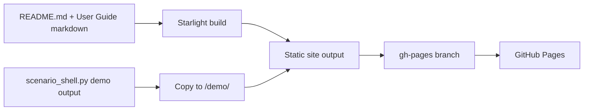

# Plan: User-Facing Documentation & Onboarding Refinement

**Status:** Proposed
**Date:** 2026-07-09
**Scope:** README restructure, dedicated User Guide on GitHub Pages, troubleshooting section, platform-specific flows, screenshot/media assets, CSV column format documentation.

---

## Motivation

The README has been rewritten for open-source readiness but now shows several friction points for new users, especially Windows users and those without Monarch Money:

1. **Information ordering** — The personal backstory and Quick Start come before any explanation of what the app *does*, whether it's right for the reader, or what features it has.
2. **Platform density** — Linux/macOS and Windows commands are interleaved inline, making either reader skip half the text.
3. **Non-Monarch flow under-documented** — Manual Entry is the primary onboarding path for most new users, but the README offers minimal guidance and no screenshots. CSV import column format is never specified.
4. **No troubleshooting section** — Common first-run issues (Python PATH, venv activation, `python` vs `python3`, Windows Firewall) have no indexed home.
5. **The README is a wall of text** — A separate, navigable User Guide on GitHub Pages (like [LearnKit](https://ctrlaltwill.github.io/LearnKit/)) would serve non-technical users far better than a single long markdown file.

---

## Approach: Two-Phase

### Phase A — README Restructure (quick wins, deployable independently)

A surgical reorganisation of the existing README without changing the User Guide architecture. This can be done now and iterated while Phase B proceeds.

### Phase B — Dedicated User Guide on GitHub Pages

A Starlight (Astro) or Jekyll documentation site served from GitHub Pages, with the live demo moved to a `/demo` subfolder. This is the long-term solution; Phase A bridges the gap.

---

## Phase A: README Restructure

### A1. Reorder sections

Current order (abbreviated):
```
Badges → Banner → How It Started → Quick Start → Table of Contents → What It Does → Feature Overview → Sample Scenarios → Web UI → Data Sources → Who This Is For → etc.
```

Proposed order:
```
Badges → Banner → **What Is Net Worth Navigator?** (1 paragraph elevator pitch)
→ **Who This Is For** / **Who This Is Not For** (up-front fit check)
→ **Quick Start** (separated into platform-specific sub-sections)
→ **Feature Overview** (table)
→ **Sample Scenarios** (what you'll see)
→ **Using the Web UI** / **Data Sources** / **Configuration**
→ **Project Structure**
→ **Security Notes** / **Support** / **License**
```

Key changes:
- "How It Started" moves to after Quick Start (or an appendix section). It's context, not onboarding.
- "What It Does" and "Who This Is For" come *before* Quick Start so the reader can decide whether to proceed.

### A2. Platform-Specific Quick Start Sections

**Pattern:** Each major step gets one collapsed detail section per platform, with clear labelled tabs:

```markdown
<details>
<summary>Linux / macOS</summary>

```bash
python3 -m venv .venv
.venv/bin/python -m pip install -r requirements.txt
```

</details>

<details>
<summary>Windows</summary>

```powershell
python -m venv .venv
.venv\Scripts\python.exe -m pip install -r requirements.txt
```

</details>
```

This eliminates inline `# Linux/macOS` / `# Windows` comments and keeps each reader's path clean. The default state is "Windows" for the novice audience, "Linux/macOS" for the advanced audience — or both collapsed until clicked.

**Alternative (if details/summary is disliked):** Separate sub-headings within each step (e.g. `#### Linux/macOS` / `#### Windows`) with clear visual spacing.

### A3. Troubleshooting Section

New section before "Security Notes" covering:

| Symptom | Likely Fix |
|---------|-----------|
| `python` not found | Install Python, check "Add to PATH" (Windows) / try `python3` (Linux) |
| `pip install` fails | Double-check you're using `.venv/bin/python` or `.venv\Scripts\python.exe`, not bare `pip` |
| `activate.ps1` execution error (Windows) | `Set-ExecutionPolicy -Scope CurrentUser RemoteSigned` then retry |
| Windows Firewall blocks the editor | Instructions from current README (uncheck Public Networks) |
| `ModuleNotFoundError` | Run `.venv/bin/python -m pip install -r requirements.txt` (not system pip) |
| Empty chart / no accounts | Check `data_source.mode` in your TOML — should be `synthetic` if you're not using Monarch |
| Can't find the output HTML | Check `output/scenarios/<slug>/<mode>/projection.html` |
| Monarch auth expired | Run `uv run python login_setup.py` in your Monarch MCP directory |
| TypeError / KeyError on render | Run `python scripts/verify_install.py` and follow the output |

Make this a table, referenced from earlier steps ("If you run into trouble, see [Troubleshooting](#troubleshooting)").

### A4. Manual Entry: Hand-Holding & Screenshots

The "Create Your Own Scenario → Web UI" flow needs:

1. **What are account totals?** A plain-language paragraph explaining:
   - "Your net worth is made of different 'buckets': cash accounts, taxable brokerage, traditional retirement accounts (IRA/401k), and Roth accounts"
   - "For Manual Entry, add up the balances in each type of account and enter the totals"
   - "Don't worry about perfect categorization — you can change it later"

2. **Screenshot**: Setup Panel's Manual Entry form with annotated callouts showing where to enter each bucket. Caption example: *"Enter your account totals here. Cash goes in the Cash field, your 401k/IRA goes in Traditional IRA, and your Roth IRA goes in Roth."*

3. **What's a liability?** Short paragraph: "If you have a mortgage or car loan, enter it in the liabilities section. The simulator will show when it's paid off and how much free cash that creates."

4. **Screenshot**: The "New from Template" flow showing the Single/Couple modal and the resulting empty form.

**Asset production:** Screenshots should be captured from the *live deployed instance* (casalemuria.lan) with sample data from the starter template. Store in `docs/assets/`. Format: PNG, ~1200px wide. Each screenshot needs a matching caption annotation file or inline markdown caption.

### A5. CSV Import: Column Format Documentation

Current README says "Export your Monarch accounts to CSV". For non-Monarch users who want to export from another tool, we need to specify the expected column format:

```csv
Date,Account Name,Group,Balance
```

or whatever the actual expected format is. Look at `src/csv_importer.py` to confirm the exact header names and data types expected. Then document:

- Required columns (name, date, balance, group/category)
- Data types (dates in ISO format, amounts as numbers with optional `$` and commas)
- How classification works after import (uses `[accounts]` section)
- Which columns are ignored
- **Screenshot**: CSV import preview in the Setup Panel showing the account table with category/owner dropdowns

### A6. "How It Started" Placement

Move to a section called "Background" or append to the end before "Support". It's a motivating story but shouldn't interrupt onboarding.

---

## Phase B: Dedicated User Guide on GitHub Pages

### B1. Architecture

**Tool:** Starlight (Astro) — the same framework LearnKit uses. It produces a static site with:
- Dark/light theme
- Full-text search
- Sidebar navigation with chapters
- Mobile-responsive
- Markdown-based content
- No backend required

**Alternative:** Jekyll with `just-the-docs` theme (simpler, built-in GitHub Pages). Trade-off: less polished search experience.

**Decision needed:** Starlight vs Jekyll. Recommendation: Starlight for the richer UX. It's worth the extra build step (static output committed to `gh-pages`).

### B2. Content Structure (User Guide)

```
Getting Started/
├── Installation (Windows / Linux / macOS)
├── Quick Start (view a sample → create your first scenario)
├── Running the Web UI
├── Command Line Basics

Key Concepts/
├── What Is a Scenario?
├── Understanding Your Projection
├── Account Types Explained
├── Events & the Event System
├── Render Modes: Deterministic, Historical, Monte Carlo

Data Sources/
├── Manual Entry (recommended for first-time users)
├── Monarch Money Integration
├── CSV Import (format, upload, classification)

Using the Web UI/
├── The Projection Shell (scenario selector, KPI strip, chart)
├── The Scenario Setup Panel
├── The Compare Page
├── Help Mode & Tooltips

Configuration/
├── Scenario TOML Reference
├── Account Classification
├── Tax Configuration & State Tables
├── Event Types Reference
├── Withdrawal Policy & Surplus Routing

Guides/
├── Scenario Comparison Walkthrough
├── Troubleshooting
├── Upgrading & Backup/Restore

Reference/
├── Project Structure
├── Data & Privacy
├── License (GPL v3.0)
├── Security Notes
```

### B3. GitHub Pages Layout

Current: `https://lemurtech.github.io/Net-Worth-Navigator/` → landing page with demo link.

Proposed:
- `/` → User Guide (Starlight index page)
- `/demo/` → Live projection shell with sample scenarios (moved from root)
- `demo/compare.html` → Compare page
- `demo/definitions.html` → Definitions reference

The demo lives as a subfolder because it's a static HTML output from `scenario_shell.py`, not part of the docs framework.

**How it works:**
1. A separate build step generates the User Guide static site
2. The pre-rendered demo files are copied into `/demo/` in the output
3. Everything goes to the `gh-pages` branch

### B4. Build & Deployment



The User Guide markdown lives under `docs/guide/` in the `main` branch. A CI workflow (or manual step) builds and deploys to `gh-pages`.

### B5. When to Ship Phase B

Phase A can ship within this iteration. Phase B is a larger investment — build the site structure, port the README content into chapter files, create the Starlight config, and set up the deployment flow. This is a separate project cycle.

---

## Dependencies

- **Screenshots require live deployment.** Need to render a sample scenario, open the Setup Panel, and capture Manual Entry form + CSV import preview + the New from Template modal.
- **Python 3.14 note.** Verify `verify_install.py` and README version requirements are accurate for Python 3.14 (Ubuntu 7.0.0-27-generic kernel, the session host).
- **Windows user testing.** Cannot test Windows-specific README changes locally (Hermes runs on Linux). User will need to review the rendered markdown from a Windows perspective.

---

## Implementation Order

1. **Phase A1–A2:** Reorder sections, split platform commands into collapsed sections — immediate README restructuring
2. **Phase A3:** Write troubleshooting table — can draft now from known issues
3. **Phase A4–A5:** Capture screenshots, draft manual entry + CSV import prose (requires live app)
4. **Phase A6:** Move "How It Started" and other cosmetic fixes
5. **Phase B:** Separate initiative — scoping and tool decision first, then content port

---

## Acceptance Criteria

- [ ] First-time reader sees "What Is Net Worth Navigator" and "Is It Right For Me?" before any setup instructions
- [ ] Windows user can follow the Quick Start end-to-end without reading Linux blocks (and vice versa)
- [ ] Non-Monarch user can find and follow the Manual Entry path without confusion about what account totals mean
- [ ] CSV import section documents the exact column format expected, with a screenshot
- [ ] Troubleshooting section covers the top 8–10 first-run issues with actionable fixes
- [ ] At least 3 screenshots in the README: Manual Entry form, CSV import preview, New from Template modal
- [ ] "How It Started" moved to a less intrusive position
